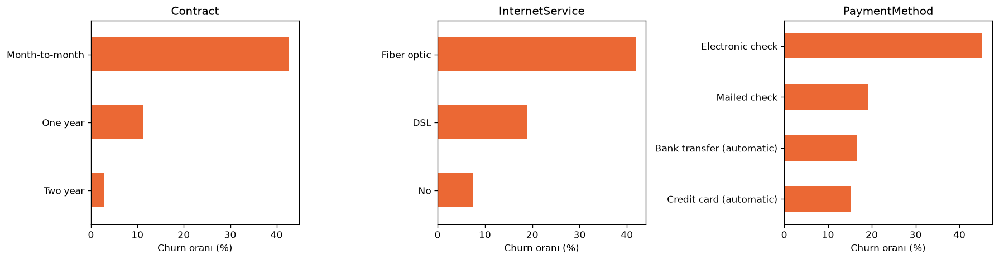

# Müşteri Kaybı (Churn) Analizi

Bir telekom şirketinin müşteri verisiyle hangi müşterilerin şirketten ayrıldığını inceledim,
basit bir tahmin modeli kurdum ve kampanya teklifinin kime yapılmasının daha kârlı olacağını hesapladım.

## Veri

[IBM Telco Customer Churn](https://github.com/IBM/telco-customer-churn-on-icp4d) veri seti
(7.043 müşteri). Dosya `data/` klasöründe.

## Ne yaptım?

1. Veriyi temizledim (`TotalCharges` sütunundaki 11 boş değer).
2. Hangi müşteri gruplarının daha çok ayrıldığına grafiklerle baktım.
3. Logistic Regression ile her müşterinin ayrılma olasılığını tahmin ettim.
4. Her müşteri için "beklenen kayıp = ayrılma olasılığı × yıllık gelir" hesapladım ve
   kampanya teklifinin kime yapılması gerektiğine baktım.

Tüm adımlar ve açıklamalar: [`notebooks/churn_analizi.ipynb`](notebooks/churn_analizi.ipynb)

## Sonuçlar

- Müşterilerin **%26.5'i** ayrılmış.
- En çok ayrılanlar: **aylık sözleşmeli** (%42.7), **fiber internet** kullanan (%41.9),
  **electronic check** ile ödeyen (%45.3) ve **ilk 12 ayındaki** (%47.4) müşteriler.



**Model (test seti, 1.409 müşteri):**

| Metrik | Değer |
|---|---|
| Accuracy | 0.796 |
| Recall | 0.545 |
| Precision | 0.636 |
| ROC-AUC | 0.839 |

Model gerçekten ayrılan müşterilerin yaklaşık yarısını yakalıyor.

**Kampanya hesabı** (varsayım: teklif başına $50 maliyet, teklif alan müşterinin %30'u kalıyor):

| Strateji | Teklif yapılan | Net kazanç |
|---|---|---|
| Herkese teklif | 1.409 | $27,524 |
| Olasılık %50'nin üstündeyse | 321 | $42,901 |
| Beklenen kayıp hesabına göre | 622 | $52,772 |

Teklifi sadece olasılığa göre değil, müşterinin ödediği ücreti de hesaba katarak vermek
bu varsayımlarla daha kârlı çıktı.

Teklif önerilen müşteriler `outputs/teklif_listesi.csv` dosyasında. Bu listeyi Power BI ile
görselleştirmeyi planlıyorum.

## Nasıl çalıştırılır?

```bash
pip install -r requirements.txt
jupyter notebook notebooks/churn_analizi.ipynb
```

## Eksikler

- $50 maliyet ve %30 kurtarma oranı benim seçtiğim örnek değerler, gerçek veri değil.
- Sadece bir model denedim.
- Veri tek bir zamana ait, müşterinin ne zaman ayrılacağını tahmin etmiyor.
